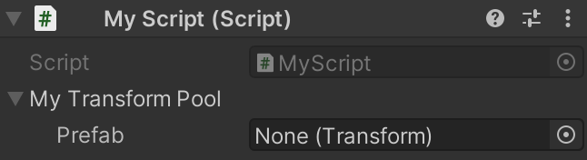
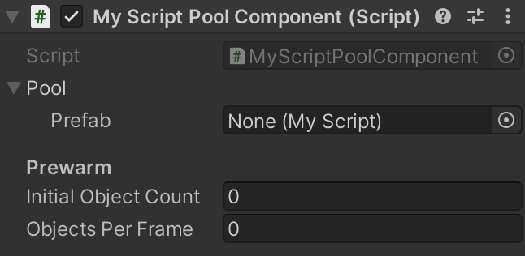
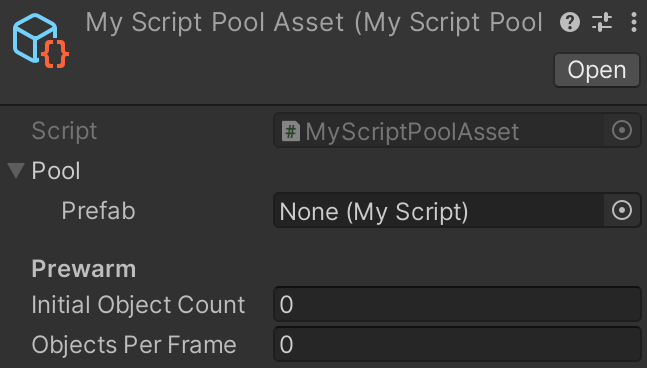

# Prefab Pool
Prefab instance pool that is configurable in the Inspector, supports any engine `Object` type and is available as a serializable C# class, MonoBehaviour and ScriptableObject.


## Features
- Prefab pools may live either as project assets ([PrefabPoolAsset](Runtime/PrefabPoolAsset.cs)), standalone components in the scene ([PrefabPoolComponent](Runtime/PrefabPoolComponent.cs)), or may be a part of your own scripts ([PrefabPool](Runtime/PrefabPool.cs)), whichever fits best your use case.
- Supports prewarming instances: configure pools to instantiate a number of prefabs when created, with an optional limit of objects per frame to avoid spikes in CPU usage.
- Supports generic typing for customizing which prefabs can be assigned to the pool.
  By default, the `GameObject` type is used in the non-generic prefab pool classes.
- Optionally add scripts that implement [IPooledObject](Runtime/IPooledObject.cs) to the prefab for receiving callbacks when object is taken from/returned to pool.
  With this, you can also easily return the prefab to the pool by calling the `IPooledObject.ReturnToPool()` extension method.
- Debug panel in inspector that shows all active and inactive pooled instances.
- [Addressables](https://docs.unity3d.com/Packages/com.unity.addressables@latest) support: just use the `AddressablePrefabPool*` variants instead of the `PrefabPool*` ones and setup the prefab's asset reference in the Inspector.
  Addressables are automatically loaded when the first instance is created and released when the pool is disposed of.


## How to install
Either:
- Install using the [Unity Package Manager](https://docs.unity3d.com/Manual/upm-ui-giturl.html) with the following URL:
  ```
  https://github.com/gilzoide/unity-prefab-pool.git#1.0.0-preview2
  ```
- Clone this repository or download a snapshot of it directly inside your project's `Assets` or `Packages` folder.


## Usage example
```cs
using System.Collections;
using Gilzoide.PrefabPool;
using UnityEngine;

public class MyScript : MonoBehaviour
{
    // 1) Reference a prefab pool:

    // 1.a) Reference for a PrefabPoolComponent from your scene.
    //      Set this in the Inspector.
    public PrefabPoolComponent myPoolComponent;
    
    // 1.b) Reference for a PrefabPoolAsset from your project.
    //      Set this in the Inspector.
    public PrefabPoolAsset myPoolAsset;
    
    // 1.c) Private/embedded PrefabPool, needs manual prewarm/disposal.
    //      Configure it in the Inspector.
    public PrefabPool myPoolVariable;


    void Start()
    {
        // 2) (optional) Prewarm private/embedded pools.
        //    Passing "instancesPerFrame: N" makes instances be
        //    created frame by frame, avoiding CPU spikes.
        myPoolVariable.Prewarm(10, instancesPerFrame: 1);
        //    Component/asset pools prewarm automatically in their `OnEnable`.

        for (int i = 0; i < 10; i++)
        {
            StartCoroutine(UseInstanceFromPool(myPoolComponent));
            StartCoroutine(UseInstanceFromPool(myPoolAsset));
            StartCoroutine(UseInstanceFromPool(myPoolVariable));
        }
    }

    // 3) Use the pool:
    //    (All prefab pool types implement IPrefabPool<>)
    public IEnumerator UseInstanceFromPool(IPrefabPool<GameObject> pool)
    {
        // 3.1) Get an instance.
        GameObject instance = pool.Get();
        
        // 3.2) Do something with your instance.
        yield return new WaitForSeconds(1);
        
        // 3.3) Return instance to pool after done with it.
        pool.Release(instance);
    }

    // 4) Dispose of private/embedded pools.
    //    Embedded pools should always be disposed when not needed anymore!
    //    Component/asset pools dispose automatically in their `OnDisable`.
    void OnDestroy()
    {
        myPoolVariable.Dispose();
    }
}
```


## Using generic prefab pools
<details>
<summary>Specifying the prefab type for <code>PrefabPool<></code></summary>

To customize the prefab type accepted by a prefab pool, just declare your variable with a concrete version of the <code>PrefabPool<></code> class.

```cs
using Gilzoide.PrefabPool;
using UnityEngine;

public class MyScript : MonoBehaviour
{
    public PrefabPool<Transform> myTransformPool;

    void OnDestroy()
    {
        myTransformPool.Dispose();
    }
}
```

</details>

<details>
<summary>Specifying the prefab type for <code>PrefabPoolComponent<></code></summary>

To customize the prefab type accepted by a prefab pool component, create a concrete class that inherits <code>PrefabPoolComponent<></code>:

```cs
using Gilzoide.PrefabPool;

public class MyScriptPoolComponent : PrefabPoolComponent<MyScript>
{
}
```

</details>

<details>
<summary>Specifying the prefab type for <code>PrefabPoolAsset<></code></summary>

To customize the prefab type accepted by a prefab pool asset, create a concrete class that inherits <code>PrefabPoolAsset<></code>:

```cs
using Gilzoide.PrefabPool;
using UnityEngine;

[CreateAssetMenu(menuName = "MyScriptPoolAsset")]
public class MyScriptPoolAsset : PrefabPoolAsset<MyScript>
{
}
```

</details>


## Similar projects
- https://github.com/BeauPrime/BeauPools
- https://github.com/coimbrastudios/object-pool
- https://github.com/jeffbert/Unity-Component-Pool
- https://github.com/expressobits/Pools
- https://github.com/FredericRP/ObjectPool
- https://github.com/coryleach/UnityPooling
- https://github.com/LeGustaVinho/pool
- https://github.com/QFSW/MasterObjectPooler2


## Why another implementation?
The reason I made a brand new implementation is because alternatives either:
- Use singleton/static pools without explicit lifetimes
- Don't support specifying generic prefab types, accepting only `GameObject`s
- Don't have Inspector-ready serializable pool types, being too code oriented
- Don't support pools as assets using `ScriptableObject`s
- Don't support asynchronous prewarming with configurable batch size, potentially leading to CPU spikes while instantiating prefabs
- Don't support Addressable asset references